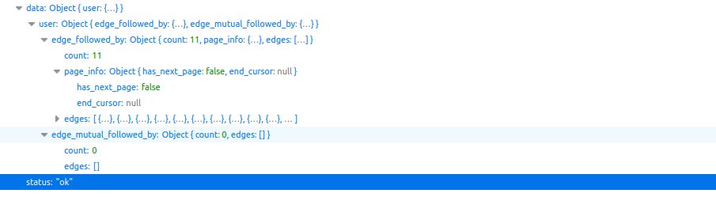

# Instagram Client
A simple python client for instagram internal API. using GraphQl endpoints && Python.


## Overview
Scrapes any instagram profile followers and followings.

## Install
**Clone the repo**
```
git clone https://...
```
**Install requirements**
```python
pip install -r requirements.txt
```

## Usage
**Code example:**
```python
from client.InstaC import InstaClient

# Authenticate using credentials
client = InstaClient('username', 'password')

# Get user profile
profile = client.get_username_profile('profile_username')

# Get user first 24 followings
followings = profile.followings()
print(followings)


# Get all followings
while followings['data']["user"]["edge_follow"]["page_info"]["has_next_page"]:
    print()
    end_cur = followings['data']['user']["edge_follow"]["page_info"]["end_cursor"]
    followings = profile.followings(end_cursor=end_cur)
    print(followings)


```

> following && followers methods will return the response they get from Instagram API.

**Output format:**




